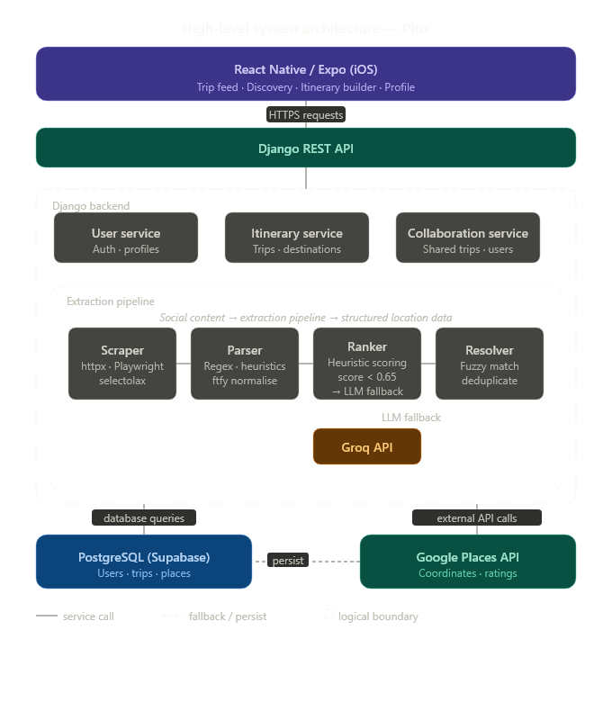
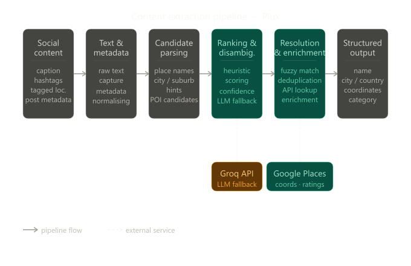

# Plux — AI-Powered Social Travel Planning Platform

An iOS app that turned social media travel posts into trip itineraries. You'd share a TikTok or Instagram post, and Plux would extract the locations, enrich them with real data (Google Places), and let you build a shareable itinerary from it.

Built as a startup idea, validated with a 200+ user survey and demoed a working TestFlight MVP to 50 users.
Shelving it to work on problems I'm more interested in.

This repo documents the architecture and technical decisions behind the project.

## Demo

<div align="center">
  <a href="https://youtube.com/shorts/5A_hpj0dwu4">
    
  </a>
  <p>Click to watch the demo</p>
</div>

## System Design Overview
<p align="center">
  
</p>

### How It Worked

```
React Native App (Expo)
│
▼
REST API (Django)
│
├── User service — auth & profiles
├── Itinerary service — trips & destinations
├── Collaboration service — shared trips between users
├── Extraction pipeline — scraper, parser, ranker, and resolver
│   └── LLM fallback via Groq API
│
▼
PostgreSQL (Supabase) & Google Places API
```

## Content Extraction Pipeline

The core technical challenge was turning noisy social media posts into structured, usable location data. Rather than relying entirely on an LLM, we built a staged pipeline that combines heuristic parsing with model fallback for ambiguous cases.

<p align="center">
  
</p>

**Pipeline stages:**

| Stage | What it does |
|---|---|
| **Scraping** | Collects raw content — captions, hashtags, embedded location text, post metadata |
| **Parsing** | Converts raw text into candidate travel entities; normalises noisy strings |
| **Ranking** | Scores candidates using heuristic signals (explicit mentions, repeated references, travel context) with LLM fallback for ambiguous cases |
| **Resolution** | Maps high-confidence candidates to real-world places via fuzzy matching, deduplication, and external API lookups |
| **Enrichment** | Adds structured metadata from Google Places — coordinates, categories, ratings, business info |

The hybrid heuristic + LLM approach was chosen because heuristics are cheap and predictable for common patterns, while the LLM handles edge cases without needing to run on every request — keeping cost low and output controllable.

→ [Full pipeline documentation](docs/content-pipeline.md)

## Tech Stack

- **Frontend:** React Native / Expo
- **Backend:** Django, REST APIs
- **Database:** PostgreSQL (Supabase)
- **APIs:** Google Places, Groq (LLM)
- **Pipeline:** Heuristic parsing + LLM fallback

## Project Structure

```
plux-public/
├── diagrams/
│   ├── system_architecture.png   # System architecture diagram
│   └── content-pipeline.png      # Content extraction pipeline diagram
├── docs/
│   ├── content-pipeline.md       # Content extraction pipeline deep-dive
│   ├── system-architecture.md    # System design overview
│   └── lessons-learned.md        # What I'd do differently
├── screenshots/                  # Product UI
└── README.md
```

## What I Took Away From It

- **Preprocessing > prompt tuning** — Social media posts follow predictable patterns, so simple heuristics handled most cases, with the LLM used for the remaining ambiguity (also reducing inference cost)
- **Multi-step pipelines over single model calls** — Unstructured content needed cleaning and normalisation before it was useful for model inference
- **Hybrid beats all-in** — The heuristic + LLM approach gave better cost/reliability tradeoffs than either approach alone
- **Consumer mobile apps are distribution-driven** — Product quality alone wasn't enough without growth loops

## Founding Team

Plux was built as an early-stage startup by a small founding team. As founder, I led product direction and delivered the majority of the engineering work, including backend architecture, content extraction pipeline design, and full-stack development.

- **Frank Wu** — Founder; backend architecture, content pipeline, API integrations, and full-stack development ([LinkedIn](https://www.linkedin.com/in/frank-wu-bba168227/))
- **Pragun Banga** — full-stack development ([LinkedIn](https://www.linkedin.com/in/pragun-banga-7818122ba/))
- **Henry Bu** — backend development ([LinkedIn](https://www.linkedin.com/in/henrybu1/))
- **Angus Chou** — frontend development ([LinkedIn](https://www.linkedin.com/in/angus-chou-bb02032aa/))
- **Joshua Ryu** — design, product, and early growth ([LinkedIn](https://www.linkedin.com/in/joshuasryu/))

**Instagram** [@get.plux](https://www.instagram.com/get.plux/)

## Code

The source code is private. This repo is focused on the design and architecture docs.
